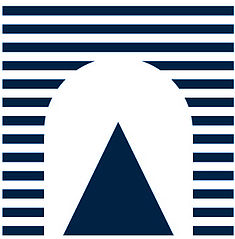
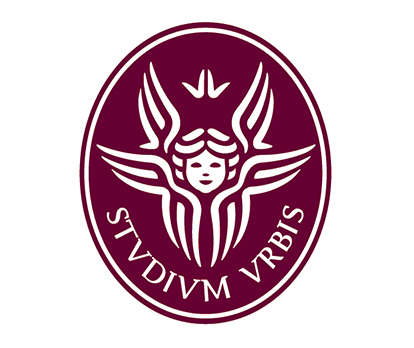
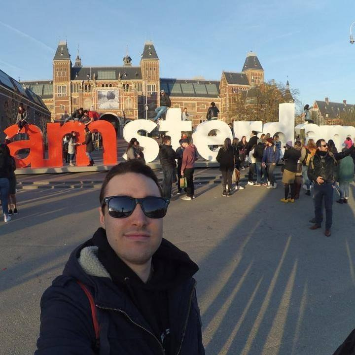

<h1 id="project"> MoveMate Project </h1>

MoveMate helps you to find other student to share your daily trip with.
* Carry other students with your Car/Moto and split the costs
* Find students who walk your own road and take the same transport with them

MoveMate is an application made for university students that will allow to get in touch with other colleagues and plan a trip to the university together.
 
<h1 id="how-works"> How it works </h1>

MoveMate can be installed on all devices with an **Android operating system, from 5.0 version, onwards.**  
When you will open it for the first time, you will have to log-in with your **facebook account**, enter your phone number and your institutional email address and the game will be done!

You will then be able to do two main things:
* ### Making your route to share it with other students
      To create a new route you be able to press '+' button on 'My routes' page, selecting if your final route will be:
        - From University
        - To University
      Then you will have to choose the type of vehicle you will want use (if it will be a motorcycle or car, you be able to
      select the number of free places and if you have an helmet more), the starting or arrival department 
      (it will be possible to choose all departments of an university), the time and the route name with 
      short description (if you will want).
* ### Finding a route made by others
      To find a route from/to university you be able to press the 'hand lens' button on the top bar and then 
      follow requested steps specifying vehicle, price and department.

When you will going to find a route, you will be able to press the result item to view its details.  
Details will include:
* Starting address and arrival department (or viceversa)
* Price per person
* Maker
* Mates

By pressing maker or mate's icon you will be able to also view his informations and contact him.

A short video tutorial below:
..[video]..

<h1 id="arch-view"> Architecture overview </h1>
...

<h1 id="install-source"> Installation &amp; source code </h1>
...

<h1 id="team"> Team presentation </h1>
<section class="site-footer" style="color: gray; text-align: left;">

 <section id="team-items">
 
   <section class="btn">
    
    <section class="btn" style="text-align: left;">
    <h3 style="color: black;">Andrea Bagordo</h3>
    <h4 style="color: gray; font-style: italic;">Computer Engineering student at Roma Tre</h4>
    <h4 style="color: gray; font-style: italic; font-weight: Bold;">Back-end Developer with ASP.NET &amp; Entity framework</h4>
    </section>
    <section class="btn"></section>
   </section>
    
   <section class="btn">
    
    <section class="btn" style="text-align: left;">
    <h3 style="color: black;">Davide Iannotta</h3>
    <h4 style="color: gray; font-style: italic;">Computer Engineering student at La Sapienza</h4>
    <h4 style="color: gray; font-style: italic; font-weight: Bold;">Back-end Developer with ASP.NET &amp; Entity framework</h4>
    </section>
    <section class="btn"></section>
   </section>
    
   <table>
    <tr>
     <td></td>
     <td width="400"><section class="btn" style="text-align: left;">
     <h3 style="color: black;">Edoardo Puglisi</h3>
     <h4 style="color: gray; font-style: italic;">Computer Engineering student at La Sapienza</h4>
     <h4 style="color: gray; font-style: italic; font-weight: Bold;">Front-end Android Developer</h4>
     </section></td>
     <td><section class="btn"></section></td>
    </tr>
   </table>
     
 </section>
</section>
