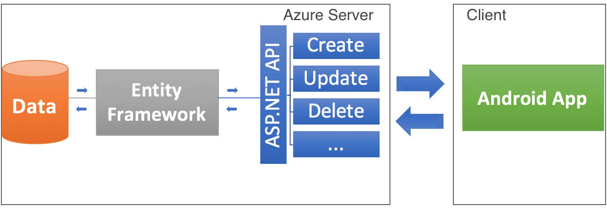
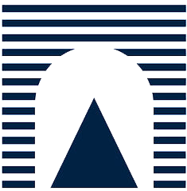

<h1 id="project"> MoveMate Project </h1>

MoveMate helps you to find other student to share your daily trip with.
* Carry other students with your Car/Moto and split the costs
* Find students who walk your own road and take the same transport with them

MoveMate is an application made for university students that will allow to get in touch with other colleagues and plan a trip to the university together.

MoveMate project was thought in 2016/2017 year during the Google Workshop, by three computer engineering students, focused on creation of a simple and helpful thing.
You will be able to find project milestones info below, during which project took shape:
* [First Milestone](https://1drv.ms/p/s!Arh0UdVHsGBcoE9vPJzfm2qYVc80)
* [Second Milestone](https://1drv.ms/p/s!Arh0UdVHsGBcoGjKhkq51oPmD5cM)
* [Third Milestone](https://drive.google.com/open?id=0B6reVBh6T0JXLThqQjZJN0NrMXc)

<!-- How it works -->
<h1 id="how-works"> How it works </h1>

MoveMate can be installed on all devices with an **Android operating system, from 5.0 version, onwards.**  
When you will open it for the first time, you will have to log-in with your **facebook account**, enter your phone number and your institutional email address and the game will be done!

You will then be able to do two main things:
* ### Making your route to share it with other students
      To create a new route you be able to press '+' button on 'My routes' page, selecting if your final route will be:
        - From University
        - To University
      Then you will have to choose the type of vehicle you will want use (if it will be a motorcycle or car, you be able to
      select the number of free places and if you have an helmet more), the starting or arrival department 
      (it will be possible to choose all departments of an university), the time and the route name with 
      short description (if you will want).
* ### Finding a route made by others
      To find a route from/to university you be able to press the 'hand lens' button on the top bar and then 
      follow requested steps specifying vehicle, price and department.

When you will going to find a route, you will be able to press the result item to view its details.  
Details will include:
* Starting address and arrival department (or viceversa)
* Price per person
* Maker
* Mates

By pressing maker or mate's icon you will be able to also view his informations and contact him.

A short video tutorial below:

<iframe width="200" height="315" src="https://www.youtube.com/embed/HstvLdfN60s" frameborder="0" allowfullscreen></iframe>

For more informations, see the [italian user documentation](https://drive.google.com/open?id=1sDPHdG0VMDcI5hbrCw1KQ4XKIJimZtGvGRbOCgYGePQ) or [english user documentation](https://drive.google.com/open?id=1f8GNwhQbvDSFEMoDLIh3-HbcW-VEwGQoPhGM1FFcUpQ).

<!-- Architecture overview -->
<h1 id="arch-view"> Architecture overview </h1>
MoveMate has been structured on a simple **CLIENT – SERVER** architecture, with an Azure application server and an Android client.
 
Azure provides some API to handle requests from Android client.
 
Android client calls this APIs to exchange information with Azure server.

All user information and computing operations will be done on server to reserve only data view to the client.

APIs provided by the server maps the CRUD paradigm, offering some operations such as:
* Student posting 
* Route posting
* Route deleting

and others.

*Architecture view below:*

To improve security, every data exchange between client and server is **encrypted using HTTPS** and the **client’s API calls must include a user identifier token** to be accepted from the server.

For more informations, see the [technical documentation](https://drive.google.com/open?id=0BxBf-ekgpA4gQ0ZNZmFCU2p5djQ).

<!-- Installation & source code -->
<h1 id="install-source"> Installation &amp; source code </h1>
By clicking here:  you will redirected to **MoveMate Google Play page** where you will be able to execute the installation.
If you are interested to know more about MoveMate implementation, see our [github page  ](https://github.com/movers-gcw)

## Feedback
If you already signed-up, <a id="seedfeed" onfocus="document.getElementById('seedfeed').style.backgroundColor = 'rgba(50, 205, 50,0.9)';" onmouseover="document.getElementById('seedfeed').style.borderColor = 'rgba(50, 205, 50,0.9)';" onmouseout="document.getElementById('seedfeed').style.borderColor = 'rgba(50, 205, 50,0.2)'; document.getElementById('seedfeed').style.backgroundColor = 'rgba(50, 205, 50,0.7)';" href="https://docs.google.com/forms/d/e/1FAIpQLSfO1ji527b9swJuDaUcQwbIOfQB8SUK0CYIQulFwFD-nLU0ow/viewform?c=0&w=1" style="border: 2px solid; border-radius: 5px; border-color: rgba(50, 205, 50,0.2); background-color: rgba(50, 205, 50,0.7);  color: white; padding: 6px; text-decoration: none;" >send a feedback</a> about your MoveMate experience. 

<!-- Team Presentation -->
<h1 id="team"> Team presentation </h1>
<section class="site-footer" style="color: gray; text-align: left;">

 <section id="team-items">
 
 <table>
  <tbody><tr>
   <td style="border: 0; padding: 0;" width="150px">
    
    
   </td>
   <td width="400px" style="border: 0;"><section class="btn" style="text-align: left;">
     <h3 style="color: black;">Andrea Bagordo</h3>
     <h4 style="margin: 0; color: gray; font-style: italic;">Computer Engineering student at Roma Tre</h4>
     <h4 style="margin: 0; color: gray; font-style: italic; font-weight: Bold;">Back-end Developer with ASP.NET &amp; Entity framework</h4>
     </section></td></tr></tbody></table>
   
   
  <table>
    <tbody><tr>
     <td style="border: 0; padding: 0;" width="150px">
      
      
</td>
     <td width="400px" style="border: 0;"><section class="btn" style="text-align: left;">
     <h3 style="color: black;">Davide Iannotta</h3>
     <h4 style="margin: 0; color: gray; font-style: italic;">Computer Engineering student at La Sapienza</h4>
     <h4 style="margin: 0; color: gray; font-style: italic; font-weight: Bold;">Back-end Developer with ASP.NET &amp; Entity framework</h4>
     </section></td></tr></tbody></table>
   
   
  <table>
   <tbody><tr>
     <td style="border: 0; padding: 0; " width="150px">
      
      
     </td>
     <td width="400px" style="border: 0;"><section class="btn" style="text-align: left;">
      <h3 style="color: black;">Edoardo Puglisi</h3>
      <h4 style="margin: 0; color: gray; font-style: italic;">Computer Engineering student at La Sapienza</h4>
      <h4 style="margin: 0; color: gray; font-style: italic; font-weight: Bold;">Front-end Android Developer</h4>
      </section></td></tr></tbody></table>
     
 </section>
</section>
